# OpenPoke Web App Architecture

## System Overview

OpenPoke is a full-stack web application with a Next.js frontend and FastAPI backend, featuring AI agents for chat interactions and task execution.

## Architecture Diagram

```mermaid
graph TB
    %% Frontend Layer
    subgraph "Frontend (Next.js 14)"
        UI[Main Page<br/>page.tsx]
        Layout[Root Layout<br/>layout.tsx]
        
        subgraph "Components"
            ChatHeader[ChatHeader]
            ChatInput[ChatInput]
            ChatMessages[ChatMessages]
            ErrorBanner[ErrorBanner]
            SuccessBanner[SuccessBanner]
            SettingsModal[SettingsModal]
        end
        
        subgraph "API Routes"
            ChatAPI[Chat API<br/>/api/chat]
            GmailAPI[Gmail API<br/>/api/gmail]
            MCPAPI[MCP API<br/>/api/mcp]
            AdminAPI[Admin API<br/>/api/admin]
            TimezoneAPI[Timezone API<br/>/api/timezone]
        end
    end
    
    %% Backend Layer
    subgraph "Backend (FastAPI)"
        App[FastAPI App<br/>app.py]
        
        subgraph "API Routes"
            ChatRouter[Chat Router<br/>/api/v1/chat]
            GmailRouter[Gmail Router<br/>/api/v1/gmail]
            MCPRouter[MCP Router<br/>/api/v1/mcp]
            AdminRouter[Admin Router<br/>/api/v1/admin]
            MetaRouter[Meta Router<br/>/api/v1/meta]
        end
        
        subgraph "AI Agents"
            InteractionAgent[Interaction Agent<br/>- Chat handling<br/>- Message routing<br/>- Agent coordination]
            ExecutionAgent[Execution Agent<br/>- Task execution<br/>- Tool usage<br/>- Gmail operations]
            BatchManager[Batch Manager<br/>- Agent lifecycle<br/>- Execution queuing]
        end
        
        subgraph "Services Layer"
            ConversationService[Conversation Service<br/>- Chat history<br/>- Message logging<br/>- Summarization]
            GmailService[Gmail Service<br/>- OAuth integration<br/>- Email processing<br/>- Importance classification]
            MCPService[MCP Service<br/>- Server management<br/>- Tool registry<br/>- External integrations]
            TriggerService[Trigger Service<br/>- Scheduled tasks<br/>- Event handling]
            AdminService[Admin Service<br/>- Status monitoring<br/>- Agent statistics]
        end
        
        subgraph "Data Layer"
            ConversationLog[Conversation Log<br/>- Chat history storage]
            ExecutionLogs[Execution Logs<br/>- Agent activity logs]
            GmailStore[Gmail Store<br/>- Seen emails cache]
            MCPStore[MCP Store<br/>- Server configurations]
            TriggerDB[Trigger Database<br/>- SQLite for triggers]
        end
    end
    
    %% External Services
    subgraph "External Services"
        OpenRouter[OpenRouter API<br/>- LLM provider]
        Composio[Composio<br/>- Gmail integration]
        MCPServers[External MCP Servers<br/>- Third-party tools]
    end
    
    %% Data Flow
    UI --> ChatAPI
    UI --> GmailAPI
    UI --> MCPAPI
    UI --> AdminAPI
    UI --> TimezoneAPI
    
    ChatAPI --> ChatRouter
    GmailAPI --> GmailRouter
    MCPAPI --> MCPRouter
    AdminAPI --> AdminRouter
    
    ChatRouter --> InteractionAgent
    ChatRouter --> ConversationService
    GmailRouter --> GmailService
    MCPRouter --> MCPService
    AdminRouter --> AdminService
    
    InteractionAgent --> ExecutionAgent
    InteractionAgent --> BatchManager
    ExecutionAgent --> GmailService
    ExecutionAgent --> MCPService
    
    ConversationService --> ConversationLog
    GmailService --> GmailStore
    MCPService --> MCPStore
    TriggerService --> TriggerDB
    
    InteractionAgent --> OpenRouter
    ExecutionAgent --> OpenRouter
    GmailService --> Composio
    MCPService --> MCPServers
    
    %% Component Relationships
    ChatHeader --> SettingsModal
    ChatInput --> ChatMessages
    ChatMessages --> ErrorBanner
    ChatMessages --> SuccessBanner
    
    SettingsModal --> GmailAPI
    SettingsModal --> MCPAPI
    SettingsModal --> TimezoneAPI
```

## Detailed Component Breakdown

### Frontend Architecture

#### Core Pages
- **Main Page (`page.tsx`)**: Central chat interface with real-time message polling
- **Layout (`layout.tsx`)**: Root layout with global styles and metadata

#### Chat Components
- **ChatHeader**: Top navigation with settings and clear history buttons
- **ChatInput**: Message input with validation and submission
- **ChatMessages**: Message display with auto-scroll functionality
- **ErrorBanner/SuccessBanner**: User feedback components
- **SettingsModal**: Comprehensive settings including Gmail and MCP configuration

#### API Integration
- **Chat API**: Real-time chat with polling mechanism
- **Gmail API**: OAuth connection and status management
- **MCP API**: External server and tool management
- **Admin API**: System status and monitoring
- **Timezone API**: Browser timezone detection and storage

### Backend Architecture

#### API Layer
- **FastAPI Application**: Main server with CORS, exception handling, and middleware
- **Route Modules**: Organized by feature (chat, gmail, mcp, admin, meta)
- **Request/Response Models**: Type-safe data validation

#### AI Agent System
- **Interaction Agent**: 
  - Handles user chat messages
  - Coordinates with execution agents
  - Manages conversation flow
  - Uses system prompts for context
  
- **Execution Agent**:
  - Executes specific tasks
  - Uses available tools (Gmail, MCP)
  - Maintains execution history
  - Supports conversation limits

- **Batch Manager**:
  - Manages agent lifecycle
  - Queues and executes agent tasks
  - Handles concurrent executions

#### Service Layer
- **Conversation Service**: Chat history, logging, and summarization
- **Gmail Service**: OAuth integration, email processing, importance classification
- **MCP Service**: External server management and tool registry
- **Trigger Service**: Scheduled tasks and event handling
- **Admin Service**: System monitoring and statistics

#### Data Persistence
- **Conversation Log**: Chat history storage
- **Execution Logs**: Agent activity tracking
- **Gmail Store**: Email cache and seen status
- **MCP Store**: Server configurations
- **Trigger Database**: SQLite for scheduled tasks

### External Integrations

#### LLM Provider
- **OpenRouter API**: Primary LLM service for both interaction and execution agents

#### Gmail Integration
- **Composio**: OAuth flow and Gmail API access
- **Email Processing**: Importance classification and automated handling

#### MCP (Model Context Protocol)
- **External Servers**: Third-party tool integrations
- **Tool Registry**: Dynamic tool discovery and management
- **Authentication**: Support for API key and OAuth auth types

## Key Features

### Real-time Chat
- Optimistic UI updates
- Polling-based message synchronization
- Auto-scroll and loading states
- Error handling and retry logic

### Agent System
- Dynamic agent creation and management
- Tool-based task execution
- Conversation history and context
- Batch processing capabilities

### Gmail Integration
- OAuth 2.0 authentication
- Email importance classification
- Automated email processing
- Profile and account management

### MCP Support
- External server management
- Tool discovery and registration
- Multiple authentication types
- Dynamic tool execution

### Admin Dashboard
- Real-time agent monitoring
- System status and statistics
- Execution tracking
- Performance metrics

## Technology Stack

### Frontend
- **Next.js 14**: React framework with App Router
- **TypeScript**: Type-safe development
- **Tailwind CSS**: Utility-first styling
- **React Hooks**: State management and lifecycle

### Backend
- **FastAPI**: Modern Python web framework
- **Pydantic**: Data validation and serialization
- **SQLite**: Local data persistence
- **Async/Await**: Asynchronous programming

### AI/ML
- **OpenRouter**: LLM API integration
- **Custom Agents**: Specialized AI agents for different tasks
- **Tool Integration**: Gmail and MCP tool usage

### External Services
- **Composio**: Gmail API integration
- **MCP Protocol**: External tool integration
- **OAuth 2.0**: Secure authentication flows
